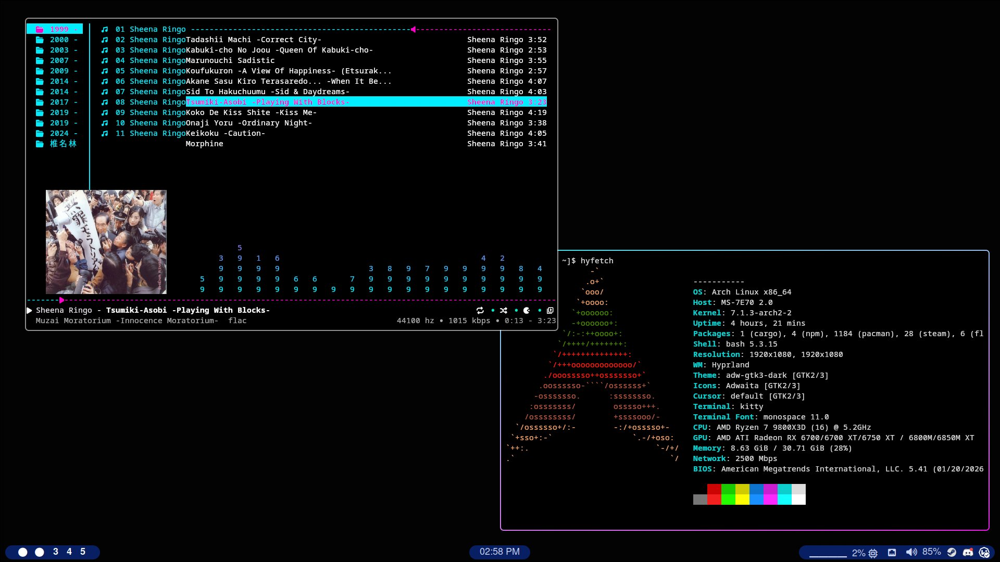

# wl28-dots
My hyprland/archlinux config

# These are my simple dots for hyprland 

## Images



### Programs and Dependencies
#### I use paru for aur but yay also works
```
Themes -
adw-gtk-theme
adwaita-cursors
adwaita-dark
adwaita-fonts
adwaita-icon-theme
adwaita-icon-theme-legacy
materia-gtk-theme


Hyprland - 
hyprcursor
hyprgraphics
hypridle
hyprland
hyprland-guiutils
hyprland-qt-support
hyprlang
hyprpaper
hyprpolkitagent
hyprqt6engine
hyprshell-bin
hyprtoolkit
hyprutils
hyprwayland-scanner
hyprwire
hyfetch
swaync
slurp
grim
nwg-look
kvantum
waybar
gnome-keyring
rofi
kitty
xdg-desktop-portal
xdg-desktop-portal-gtk
xdg-desktop-portal-hyprland

Thunar - 
thunar
thunar-archive-plugin
tumbler
udisks2
gvfs
file-roller
ffmpegthumbnailer

Code Editors -
visual-studio-code-bin
zed

Fonts - 
gsfonts
noto-fonts
noto-fonts-cjk
noto-fonts-emoji
ttf-icomoon-feather
ttf-jetbrains-mono
ttf-liberation
ttf-nerd-fonts-symbols
ttf-nerd-fonts-symbols-common

Audio - 
pipewire
pipewire-alsa
pipewire-audio
pipewire-jack
pipewire-pulse
pipewire-session-manager
playerctl
pavucontrol
cable
mpd
mpd-mpris

Web Browser -
Librewolf

Wine -
wine
winetricks
protonplus
protontricks

Misc -
btop
git
wget
sudo
cava
rmpc
rust
btrfs-progs
mpv
```